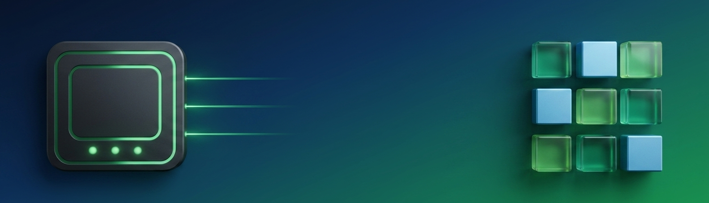
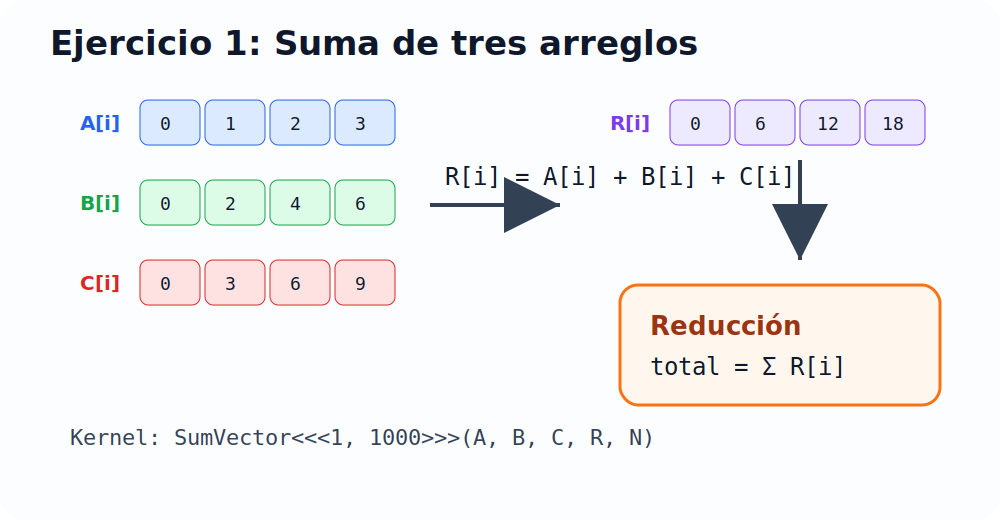
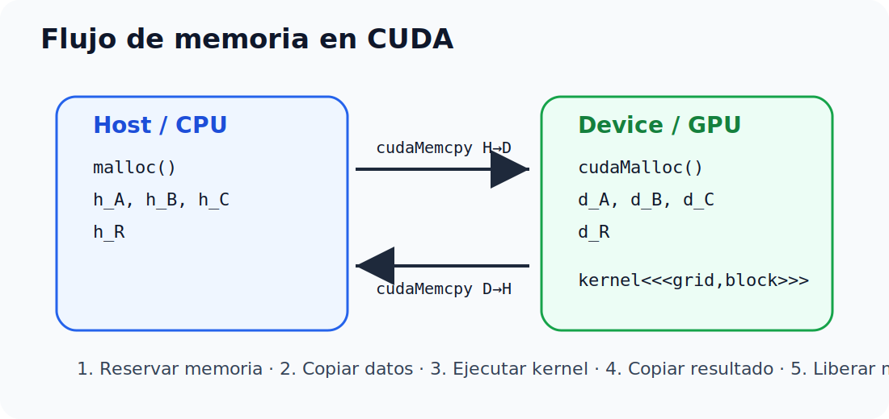
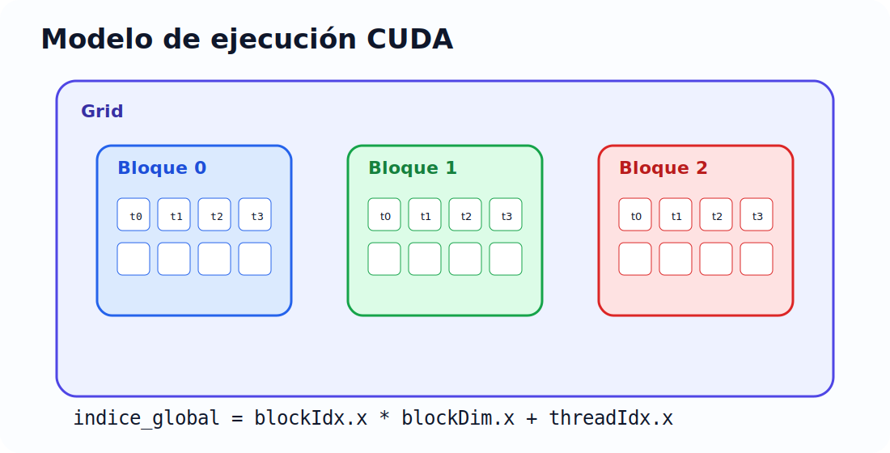
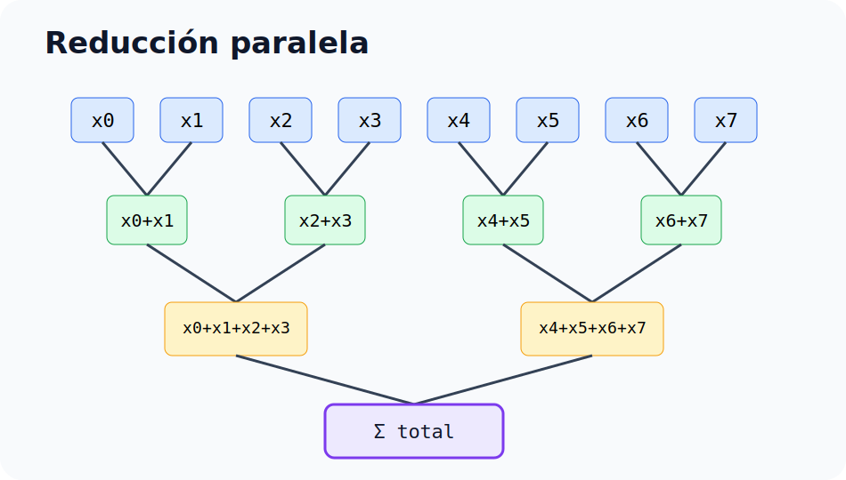

# Taller CUDA - Programación Paralela y Computación Distribuida

<p align="center">
  
</p>

<p align="center">
  <a href="https://colab.research.google.com/github/Albonire/taller-cuda-unipamplona/blob/main/notebooks/Taller_CUDA_Colab.ipynb">
    
  </a>
</p>

Repositorio para el taller de introducción a CUDA.  
Incluye ejemplos en **C CPU** y **CUDA C**, preparados para ejecutarse en **Google Colab con GPU NVIDIA T4**.

---

## Estructura del proyecto

```text
.
├── README.md
├── Makefile
├── src/
│   ├── sum_array.c
│   ├── sum_array.cu
│   ├── ej02_hello_gpu.cu
│   ├── ej03_device_info.cu
│   ├── ej04_vector_add.cu
│   ├── ej05_matrix_add.cu
│   ├── ej06_matrix_mul.cu
│   ├── ej07_shared_reduction.cu
│   ├── ej08_large_vector_timing.cu
│   └── ej09_unified_memory.cu
├── notebooks/
│   └── Taller_CUDA_Colab.ipynb
├── assets/svg/
│   ├── banner_cuda.svg
│   ├── sum_three_arrays.svg
│   ├── cuda_memory_flow.svg
│   ├── grid_blocks_threads.svg
│   └── reduction_tree.svg
└── scripts/
    ├── detect_arch.sh
    └── run_all.sh
```

---

## Ejercicios incluidos

| Ejercicio | Archivo | Tema |
|---|---|---|
| 1 CPU | `src/sum_array.c` | Suma de tres arreglos en C |
| 1 CUDA | `src/sum_array.cu` | Suma de tres arreglos en GPU y reducción |
| 2 | `src/ej02_hello_gpu.cu` | Hola mundo desde GPU |
| 3 | `src/ej03_device_info.cu` | Información del dispositivo CUDA |
| 4 | `src/ej04_vector_add.cu` | Suma de vectores en paralelo |
| 5 | `src/ej05_matrix_add.cu` | Suma de matrices con grid 2D |
| 6 | `src/ej06_matrix_mul.cu` | Multiplicación de matrices |
| 7 | `src/ej07_shared_reduction.cu` | Reducción usando memoria compartida |
| 8 | `src/ej08_large_vector_timing.cu` | Medición CPU vs GPU con 10 millones de floats |
| 9 | `src/ej09_unified_memory.cu` | Memoria unificada y manejo de errores |

---

## Diagrama del ejercicio 1

<p align="center">
  
</p>

El ejercicio principal calcula:

```text
R[i] = A[i] + B[i] + C[i]
```

Luego calcula la reducción:

```text
total = Σ R[i]
```

Para `N = 1000`, con:

```text
A[i] = i
B[i] = 2i
C[i] = 3i
```

Entonces:

```text
R[i] = 6i
```

Y la reducción esperada es:

```text
6 * (0 + 1 + 2 + ... + 999) = 2,997,000
```

---

## Flujo de memoria CUDA

<p align="center">
  
</p>

---

## Grid, bloques e hilos

<p align="center">
  
</p>

---

## Reducción paralela

<p align="center">
  
</p>

---

## Ejecutar en Google Colab

1. Sube este repositorio a GitHub.
2. Abre el notebook:

```text
notebooks/Taller_CUDA_Colab.ipynb
```

O usa el botón de Colab que aparece arriba.

3. En Colab activa GPU:

```text
Runtime > Change runtime type > Hardware accelerator > GPU
```

4. Verifica que tienes GPU:

```bash
!nvidia-smi
!nvcc --version
```

5. Ejecuta todos los ejercicios:

```bash
!bash scripts/run_all.sh
```

---

## Ejecutar localmente en Fedora

### Solo CPU

```bash
gcc -O2 src/sum_array.c -o bin/sum_array_cpu
./bin/sum_array_cpu
```

### CUDA local

Solo funcionará si tienes:

- GPU NVIDIA
- Driver NVIDIA instalado
- CUDA Toolkit con `nvcc`

Compilar un ejercicio:

```bash
nvcc -O2 -arch=sm_75 src/sum_array.cu -o bin/sum_array_cuda
./bin/sum_array_cuda
```

Compilar todo con Makefile:

```bash
make all ARCH=sm_75
make run ARCH=sm_75
```

En Colab T4 normalmente se usa:

```text
sm_75
```

---

## Salida esperada del ejercicio 1 CUDA

```text
Primeros 5 valores de R[i] = A[i]+B[i]+C[i]:
  R[0] = 0
  R[1] = 6
  R[2] = 12
  R[3] = 18
  R[4] = 24
Reduccion suma(R): 2997000
```

---

## Subir a GitHub

Desde la carpeta del proyecto:

```bash
git add .
git commit -m "Taller CUDA completo"
git branch -M main
git remote add origin git@github.com:Albonire/taller-cuda-unipamplona.git
git push -u origin main
```

